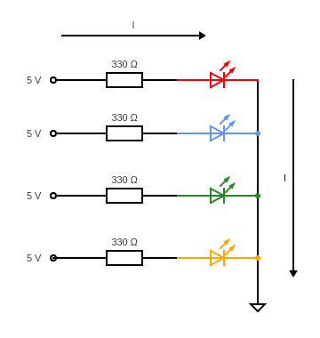

# Arduino-projects

Welcome to my arudino repo! 
I started learning about arduino and creating projects using the microcontroller in the beginning of summer 2024. The goal by the end of the summer is to create a remote controlled robot. 

## [4 Bit Binary LED counter](https://github.com/vhunany/arduino-projects/blob/31ad307a5788ef7deb9d413bbdfdf99d88a265b4/BareMinimum_4_bit_binary_counter.ino)

#### Understanding LEDs

#### Circuit Schematic

#### Video

## [Reading the Voltage off of a Potentiometer](https://github.com/vhunany/arduino-projects/blob/f511d532f07c511aa0e672014aeb95afc2f9c038/BareMinimum_reading_voltage_across_potentiometer.ino)

#### Potentiomter Pinout Diagram
 
A potentiometer (pot) has 3 leads. The first lead as depecticed in the image, or the one of the front two leads (like the pot used in the for this project), is a resistor with R1. The last lead, or the lead right next to it (like the one in used in the project), has a resistance of R2. The middle lead or the back lead is the total resistance, Rt. As the knob is turned to CCW, R2 -> 0. As the knob is turned CW, R1 -> 0. Rt is a constant and depends on the specific pot you are using. For this project we use a pot of 10k Ω (Rt = 10k Ω). 

#### Circuit Schematic 
 $~~~~~~~~~~~$ 
* Both images are of the same curcuit. The image on the left is the EU/IEC box symbol for resistance while the image on the right is using the US symbol.

#### Video 

